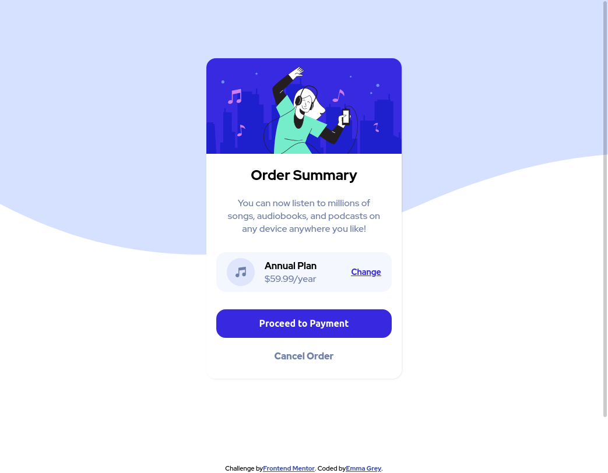

# Frontend Mentor - Order summary card solution

This is a solution to the [Order summary card challenge on Frontend Mentor](https://www.frontendmentor.io/challenges/order-summary-component-QlPmajDUj). Frontend Mentor challenges help you improve your coding skills by building realistic projects. 

## Table of contents

- [Overview](#overview)
  - [The challenge](#the-challenge)
  - [Screenshot](#screenshot)
  - [Links](#links)
- [My process](#my-process)
  - [Built with](#built-with)
  - [What I learned](#what-i-learned)
  - [Continued development](#continued-development)
  - [Useful resources](#useful-resources)
- [Author](#author)

## Overview

### The challenge

- build out this order summary card component and get it looking as close to the design as possible.

Users should be able to:

- See hover states for interactive elements

### Screenshot



### Links

- Solution URL: [https://github.com/emgrey02/order-summary-component](https://github.com/emgrey02/order-summary-component)
- Live Site URL: [https://emgrey02.github.io/order-summary-component](https://emgrey02.github.io/order-summary-component)

## My process

### Built with

- Semantic HTML5 markup
- CSS custom properties
- Flexbox
- Mobile-first workflow
- [Styled Components](https://styled-components.com/) - For styles


### What I learned

I'm just beginning to replicate website designs to enforce the HTML and CSS knowledge I've gained so far. Through this challenge, I learned that I have a pretty good understanding of these languages. 
In particular, I have a good understanding of Flexbox, since that is what I used for the layout of this component. 

For example, I nested flexboxes for the layout of the annual plan price.

```css
#card {
  display: flex;
  flex-direction: column;
  align-items: center;
}

.annual-plan-wrapper {
  display: flex;
  justify-content: space-around;
  align-items: center;
}
```
I also strived to use semantic HTML rather than a bunch of divs. I wrapped the component in section tags, and used header and p tags when necessary. I used divs to enclose sections within the component.

Design-wise, since the colors and fonts were supplied to me, those were easy to implement. The one thing I really learned in this challenge was how to handle background images. 

I was provided a background image (svg file) for the mobile version, and one for the desktop version. I handled each differently:

```css
body {
  background-image: url(images/pattern-background-mobile.svg);
    background-size: cover;
    background-repeat: repeat-x;
}

@media (min-width: 375px) {
  body {
    background-image: url(images/pattern-background-desktop.svg);
    background-size: auto;
    background-repeat: repeat-x;
    height: 100vh;
  }
}
```


### Continued development

In future projects, I want to practice CSS Grid, since my go-to is usually CSS Flexbox. 

### Useful resources

- [W3 Schools Background property](https://www.w3schools.com/cssref/pr_background-image.asp) - This taught me about all the options I have when dealing with background images. I recommend this for anyone confused about what to do with different background images like me.

## Author

- Website - [Emma Grey](https://emgrey02.github.io)
- Frontend Mentor - [@emgrey02](https://www.frontendmentor.io/profile/emgrey02)
- Twitter - [@greyypse](https://www.twitter.com/greyypse)
